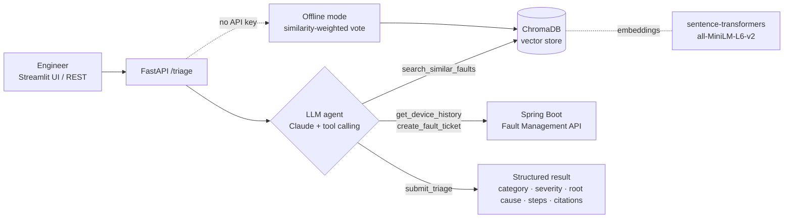

# AI Network Fault Triage Assistant

An AI assistant for network operations (NOC) teams. An engineer describes a fault in plain English, and the assistant **finds similar past faults with RAG (retrieval-augmented generation)**, **suggests the likely root cause, severity and fix while citing the past tickets it used**, and can **open a ticket through a REST API using LLM tool calling**.

It extends my [Network Fault Management API](https://github.com/KSC0219/network-fault-management) (Spring Boot), which it calls as a tool.

```
Engineer: "BGP session with our ISP keeps dropping every few minutes"

Assistant: Category: BGP flap · Severity: CRITICAL · Confidence: 98%
           Likely root cause: MTU mismatch causing large BGP update packets to drop
           Steps: 1. Align the interface MTU on both ends
                  2. Verify the MD5 password matches the ISP
           Evidence: past faults #1036, #1033, #1035
```

## How it works



1. **Knowledge base.** 150 historical resolved faults across 15 categories (BGP flaps, STP loops, DNS failures, fiber cuts and more) are embedded and stored in **ChromaDB**.
2. **Agent loop.** Claude receives four tools and decides which to call. It searches for similar faults (and searches again with new wording if the results look weak), checks the device's fault history, optionally opens a ticket, and ends by calling `submit_triage`. That forces a **structured JSON result** that is validated with Pydantic.
3. **Guardrails.**
   - The system prompt requires answers to be grounded in retrieved faults and to cite their ids.
   - Ticket creation is blocked unless the user explicitly allows it.
   - The agent has a step limit.
   - If the agent never submits an answer, it falls back to offline triage.
4. **Offline mode.** Without an API key, a similarity-weighted vote over the top-5 retrieved faults picks the category, root cause and fixes, so the demo always works.

## Evaluation

A hand-written test set of **50 fault descriptions** (`eval/eval_set.json`), phrased differently from the knowledge base, each labelled with its expected category.

```bash
python -m triage.evaluate          # retrieval + offline triage
python -m triage.evaluate --llm    # also evaluates the LLM agent (needs an API key)
```

| Metric | Result |
|---|---|
| Retrieval hit@1 | 0.96 |
| Retrieval hit@3 | 0.96 |
| Retrieval hit@5 | 0.98 |
| Retrieval MRR | 0.964 |
| Offline triage accuracy | 0.94 |

*Measured with the offline hashing embedder. Re-run the evaluation with sentence-transformers and with `--llm` to fill in those numbers.* Failure cases are saved in `eval/results.json` for error analysis.

The evaluation also guided a design change. A plain majority vote over the top-7 results scored **0.90** accuracy. Weighting each vote by similarity³ over the top-5 raised it to **0.94**.

## Tech stack

| Area | Tools |
|---|---|
| LLM and agents | Anthropic Claude API (tool use / function calling), structured outputs |
| RAG | ChromaDB vector store, sentence-transformers embeddings (offline hashing fallback) |
| Backend | FastAPI, Pydantic, httpx, integration with the Spring Boot REST API |
| UI | Streamlit |
| Quality | pytest (11 tests, including a scripted fake LLM to test the agent loop), an evaluation harness |
| Deploy | Docker |

## Project structure

```
triage/
├── agent.py           LLM agent: tool definitions and the tool-calling loop
├── knowledge_base.py  ChromaDB vector store (index + semantic search)
├── embeddings.py      sentence-transformers / offline hashing embedders
├── offline.py         retrieval-only triage (no API key needed)
├── fault_api.py       client for the Spring Boot API, plus an in-memory mock
├── service.py         chooses LLM or offline mode
├── api.py             FastAPI endpoints
├── evaluate.py        evaluation harness (hit@k, MRR, accuracy)
└── models.py          Pydantic request/response schemas
ui/streamlit_app.py    web UI
data/fault_history.json, eval/eval_set.json, scripts/generate_history.py, tests/
```

## Running it

```bash
python -m venv venv && source venv/bin/activate     # Windows: venv\Scripts\activate
pip install -r requirements.txt
cp .env.example .env                                # add ANTHROPIC_API_KEY for LLM mode (optional)
```

| What | Command |
|---|---|
| Web UI | `streamlit run ui/streamlit_app.py` |
| REST API | `uvicorn triage.api:app --reload`, with docs at http://localhost:8000/docs |
| Tests | `python -m pytest` |
| Docker | `docker build -t fault-triage . && docker run -p 8000:8000 --env-file .env fault-triage` |

To connect it to the real Java service, start the Network Fault Management API and set `FAULT_API_URL=http://localhost:8080`.

### Example API call

```bash
curl -X POST http://localhost:8000/triage -H "Content-Type: application/json" \
  -d '{"description": "IPsec tunnel to the branch is down after key rotation",
       "device_name": "fw-blr-edge-01", "create_ticket": true}'
```

## About the data

The fault history is **synthetic**. It is generated by `scripts/generate_history.py` from realistic NOC scenarios, because real ticket data is confidential. To use real tickets, export them to `data/fault_history.json` with the same fields and delete `.chroma/` to re-index.

## Possible improvements

- Hybrid search (BM25 + vectors) and a re-ranker
- LLM-as-judge evaluation of root-cause quality, not only the category
- Auto-indexing of newly resolved tickets from the Java API
